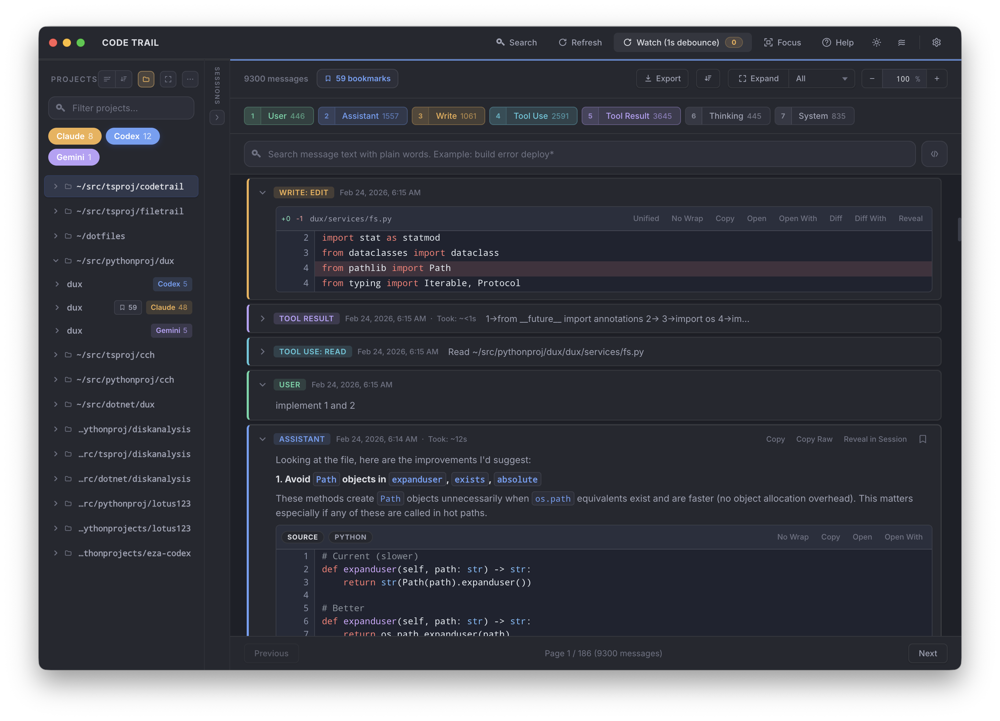

# Code Trail

A local desktop app for browsing, searching, and revisiting your AI coding session history across **Claude**, **Codex**, and **Gemini** — all from one interface.

Code Trail discovers session files from each provider's local directory, parses them into a unified format, indexes everything into SQLite, and gives you fast full-text search with filtering by provider, project, and message type.



## Features

- **Multi-provider support** — Claude Code, Codex CLI, and Gemini CLI sessions in one place.
- **Full-text search** — BM25-ranked search across all messages with highlighted snippets.
- **Project and session browser** — Navigate sessions grouped by project, with deep links to individual messages.
- **Category filters** — Filter by User, Assistant, Tool Use, Write (edits), Tool Result, Thinking, and System messages.
- **Incremental indexing** — Only re-indexes files that changed (based on size + mtime).
- **Customizable typography** — Configurable font family and size for both regular and monospace text.
- **Persistent UI state** — Pane widths, filters, scroll position, theme, and selected session are all remembered across restarts.
- **Open source locations** — Jump to the original session file or project directory from the UI.

## Prerequisites

- **[Bun](https://bun.sh/)** v1.1+ — used as the package manager and script runner.
- **Node.js** v20+ — required by Electron and native modules.
- **macOS, Linux, or Windows** — macOS is the primary development target. The `.app` packaging script is macOS-only, but the dev workflow works on all platforms.

## Getting Started

```bash
# Clone the repository
git clone https://github.com/anthropics/codetrail.git
cd codetrail

# Install dependencies
bun install

# Build and launch the desktop app
bun run desktop:start
```

`desktop:start` runs the build step automatically before launching Electron.

## Development

### Project Structure

```
codetrail/
  packages/core/       Core library: discovery, parsing, indexing, search
  apps/desktop/        Electron app: main process, preload, React renderer
  biome.json           Linter and formatter config
  vitest.config.ts     Test runner config
  tsconfig.json        Shared TypeScript config (strict mode)
```

### Day-to-Day Commands

```bash
# Launch the app (builds first)
bun run desktop:start

# Run linting, typechecking, and tests
bun run ci

# Run individual checks
bun run lint          # Biome lint
bun run format        # Biome format (auto-fix)
bun run typecheck     # TypeScript strict check
bun run test          # Vitest unit tests
bun run test:watch    # Vitest in watch mode

# Build desktop app without launching
bun run desktop:build
```

### Environment Variables

| Variable | Effect |
|---|---|
| `CODETRAIL_OPEN_DEVTOOLS=1` | Opens Chrome DevTools on launch |
| `CODETRAIL_DEBUG_RENDERER=1` | Logs renderer lifecycle events to the terminal |
| `CODETRAIL_RENDERER_URL=http://...` | Loads the renderer from a URL instead of the local build (useful for hot-reload dev servers) |

### Native Module Rebuilding

Code Trail uses `better-sqlite3`, which requires a native binary matching the Electron ABI. The build script handles this automatically, but if you see ABI mismatch errors:

```bash
cd apps/desktop
bun run fix:native
```

This verifies the current binary and rebuilds it if needed.

## Building a macOS App

To produce a standalone `.app` bundle and `.zip` archive:

```bash
# Build for your current architecture (auto-detected)
bun run desktop:make:mac

# Build for a specific architecture
bun run desktop:make:mac:arm64   # Apple Silicon
bun run desktop:make:mac:x64     # Intel
```

The output is written to `apps/desktop/out/`. The script:

1. Builds the TypeScript bundles
2. Verifies/rebuilds the native SQLite binary
3. Materializes dependencies for Electron Forge
4. Generates the `.icns` icon
5. Packages the `.app` bundle and compresses it into a `.zip`

> The macOS packaging script requires macOS. It uses `ditto` and `PlistBuddy` which are macOS-only tools.

## How It Works

Code Trail reads session files from the default provider directories:

| Provider | Directory |
|---|---|
| Claude Code | `~/.claude/projects/` |
| Codex CLI | `~/.codex/sessions/` |
| Gemini CLI | `~/.gemini/tmp/` and `~/.gemini/history/` |

Each session file is parsed into a canonical message format, indexed into a local SQLite database with FTS5 for full-text search, and made available through the UI. The database and settings are stored in the Electron `userData` directory (typically `~/Library/Application Support/Code Trail/` on macOS).

No data leaves your machine. Everything is local.

## Tech Stack

- **Electron 35** + **React 19** + **TypeScript** (strict mode)
- **SQLite** via `better-sqlite3` with FTS5 full-text search and WAL mode
- **Zod** for runtime schema validation on all IPC contracts
- **Bun** workspaces for monorepo management
- **Biome** for linting and formatting
- **Vitest** for unit and integration tests

## License

[MIT](LICENSE)

---

Built with [OpenAI Codex](https://openai.com/codex).
