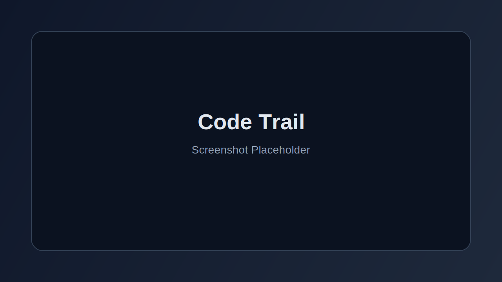

# Code Trail

Code Trail is a local desktop app for indexing and exploring AI coding session history across Claude, Codex, and Gemini.

It helps you search, filter, and revisit prior coding conversations, tool calls, and edits from one interface.

## What Code Trail Can Do

- Discover session files from local provider directories.
- Parse provider-specific formats into one canonical message model.
- Index sessions/messages into SQLite with incremental updates.
- Run full-text search with facets (provider/category/project filters).
- Browse projects and sessions with deep links to exact messages.
- Open original file/session locations directly from the UI.
- Persist UI state (pane widths, filters, zoom) between runs.

## Screenshot

_(Replace with a real screenshot once available.)_

## Tech Stack

- Electron + React + TypeScript
- SQLite (`better-sqlite3`) + FTS
- Bun workspaces
- Vitest + Biome + TypeScript strict mode

## Development

- Install dependencies: `bun install`
- Lint/typecheck/test: `bun run ci`
- Build desktop app: `bun run desktop:build`
- Run desktop app: `bun run desktop:start`
- Build macOS app bundle: `bun run desktop:make:mac`

## Data Locations (macOS)

Code Trail uses Electron `userData` for state and database files.
Typical location:

- `<userData>/ui-state.json`
- `<userData>/codetrail.sqlite`

## Built With Codex

This project is fully written in Codex.
