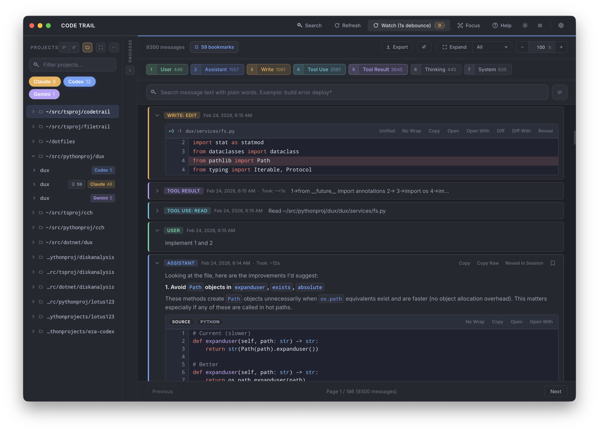

# Code Trail

A local desktop app for browsing, searching, and revisiting your AI coding session history across **Claude**, **Codex**, **Gemini**, **Cursor**, and **VS Code Copilot** from one interface.

Code Trail discovers session files from each provider's local directory, parses them into a unified format, indexes everything into SQLite, and gives you fast full-text search with filtering by provider, project, and message type.



## Features

- **Multi-provider support** - Claude Code, Codex CLI, Gemini CLI, Cursor, and VS Code Copilot sessions in one place.
- **Full-text search** - BM25-ranked search across all messages with highlighted snippets.
- **Project and session browser** - Navigate sessions grouped by project, with deep links to individual messages.
- **Category filters** - Filter by User, Assistant, Tool Use, Write (edits), Tool Result, Thinking, and System messages.
- **Incremental indexing** - Only re-indexes files that changed based on size and mtime.

## Development

### Prerequisites

- **[Bun](https://bun.sh/)** v1.1+ for package management and scripts
- **Node.js** v20 or v22 LTS
- **macOS** or _Windows (experimental)_

### Mac

Prerequisites:

- Install Xcode Command Line Tools if needed:

```bash
xcode-select --install
```

Setup and run:

```bash
git clone https://github.com/mdemirhan/codetrail.git
cd codetrail
bun install
bun run desktop:start
```

### Windows

Use **Node.js 22 LTS** on a clean machine for the smoothest native-module setup.

Windows support is still experimental and not well tested yet. It should be treated as best-effort for now. Contributions to improve Windows support are very welcome.

Prerequisites:

- **Python 3**
- A supported Windows C++ toolchain:
  - **Visual Studio 2026** with the **Desktop development with C++** workload when the install is using `node-gyp` 12+
  - or **Visual Studio Build Tools 2022** with the **Desktop development with C++** workload

Setup and run:

```powershell
git clone https://github.com/mdemirhan/codetrail.git
cd codetrail
bun install
bun run desktop:start
```

If `better-sqlite3` fails during install or Electron reports a native ABI mismatch, run:

```powershell
bun run --cwd apps/desktop fix:native
```

### Project Structure

```text
codetrail/
  packages/core/       Core library: discovery, parsing, indexing, search
  apps/desktop/        Electron app: main process, preload, React renderer
  biome.json           Linter and formatter config
  vitest.config.ts     Test runner config
  tsconfig.json        Shared TypeScript config (strict mode)
```

### Day-to-Day Commands

```bash
# Launch the app (builds first)
bun run desktop:start

# Run linting, typechecking, and tests
bun run ci

# Run individual checks
bun run lint
bun run format
bun run typecheck
bun run test
bun run test:watch

# Build desktop app without launching
bun run desktop:build

# Check platform boundary rules
bun run check:platform-boundaries
```

### Environment Variables

| Variable | Effect |
|---|---|
| `CODETRAIL_OPEN_DEVTOOLS=1` | Opens Chrome DevTools on launch |
| `CODETRAIL_DEBUG_RENDERER=1` | Logs renderer lifecycle events to the terminal |
| `CODETRAIL_RENDERER_URL=http://...` | Loads the renderer from a URL instead of the local build |

## Build Release Binaries

### Install

Prebuilt binaries are published on [GitHub Releases](https://github.com/mdemirhan/codetrail/releases).

- **macOS**: download the macOS zip from Releases, extract it, and open `Code Trail.app`. Because builds are ad-hoc signed and not notarized, Gatekeeper may require Finder `Open` or:

```bash
xattr -dr com.apple.quarantine "/Applications/Code Trail.app"
```

- **Windows**: experimental. Download either `CodeTrailSetup.exe` or the portable `.zip` from Releases if you want to try it, but expect rough edges. Contributions to improve Windows support are welcome.

### Mac

Build your own local macOS app bundle on macOS:

```bash
# Current architecture
bun run desktop:make:mac

# Specific architecture
bun run desktop:make:mac:arm64
bun run desktop:make:mac:x64
```

Artifacts are written to `apps/desktop/out/`.

These outputs are for local use and internal testing. They are ad-hoc signed, not notarized, and should not be treated as public distribution artifacts.

The macOS packaging flow:

1. Builds the TypeScript bundles
2. Verifies and rebuilds native Electron modules when needed
3. Materializes dependencies for Electron Forge
4. Generates the `.icns` icon
5. Produces a `.app` bundle plus a `.zip`

### Windows

Build your own Windows release artifacts on Windows:

```powershell
bun run desktop:make:win
```

Artifacts are written to `apps/desktop/out/`.

Windows builds are still experimental and have not had the same level of testing as macOS builds.

The Windows release flow:

1. Builds the TypeScript bundles
2. Verifies and rebuilds native Electron modules when needed
3. Generates the `.ico` icon
4. Materializes runtime dependencies for Electron Forge
5. Produces `CodeTrailSetup.exe` and a portable `.zip`

## How It Works

Code Trail reads session files from the default provider directories:

| Provider | Directory |
|---|---|
| Claude Code | `~/.claude/projects/` |
| Codex CLI | `~/.codex/sessions/` |
| Gemini CLI | `~/.gemini/tmp/` and `~/.gemini/history/` |
| Cursor | `~/.cursor/projects/` |
| VS Code Copilot | `.../Code/User/workspaceStorage/*/chatSessions/` |

Each session file is parsed into a canonical message format, indexed into a local SQLite database with FTS5 for full-text search, and made available through the UI. The database and settings are stored in the Electron `userData` directory, typically `~/Library/Application Support/Code Trail/` on macOS or `%APPDATA%\Code Trail\` on Windows.

No data leaves your machine. Everything is local.

## Tech Stack

- **Electron 35** + **React 19** + **TypeScript**
- **SQLite** via `better-sqlite3` with FTS5 and WAL mode
- **Zod** for runtime schema validation on IPC contracts
- **Bun** workspaces for monorepo management
- **Biome** for linting and formatting
- **Vitest** for unit and integration tests

## License

[MIT](LICENSE)

---

Built with [OpenAI Codex](https://openai.com/codex).
